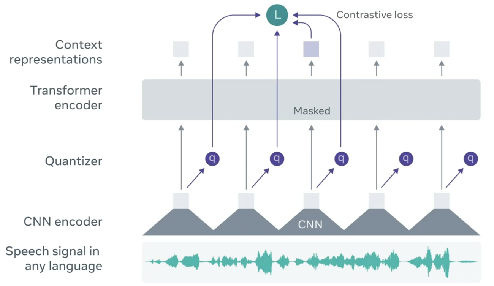
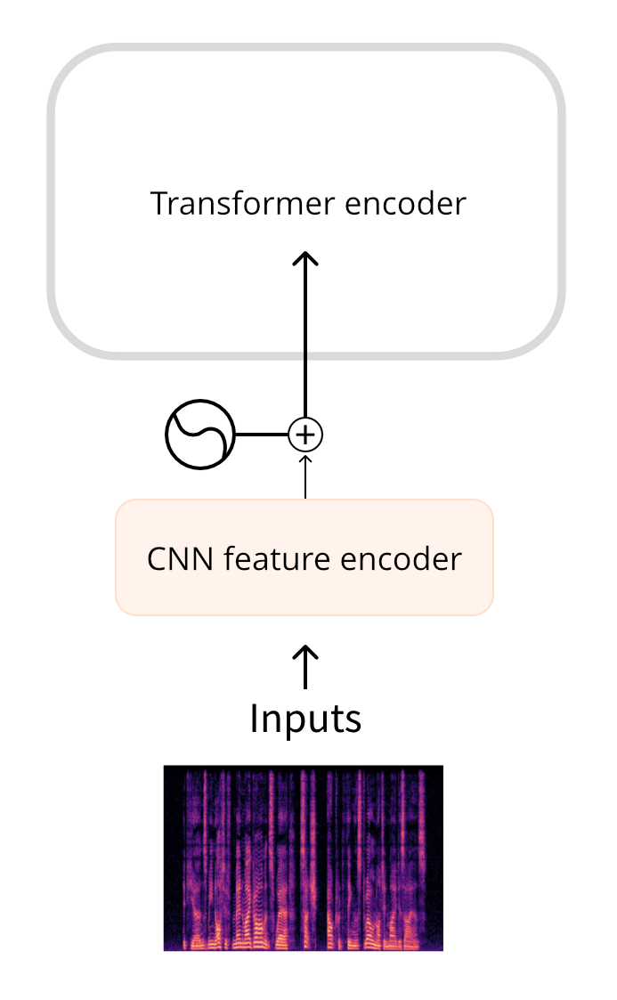

# Refresher on transformer models

In this course we will primarily consider transformer models and how they can be applied to audio tasks. While you don't need to know the inner details of these models, it's useful to understand the main concepts that make them work, so here's a quick refresher. For a deep dive into transformers, check out our [NLP Course](https://huggingface.co/course/chapter1/1).

## How does a transformer work?

The original transformer model was designed to translate written text from one language into another. Its architecture looked like this:

On the left is the **encoder** and on the right is the **decoder**.

- The encoder receives an input, in this case a sequence of text tokens, and builds a representation of it (its features). This part of the model is trained to acquire understanding from the input.

- The decoder uses the encoder’s representation (the features) along with other inputs to generate a target sequence. This part of the model is trained to generated outputs. In the original design, the output sequence consisted of text tokens.

There are also transformer-based models that only use the encoder part (good for tasks that require understanding of the input, such as classification), or only the decoder part (good for tasks such as text generation).

A key feature of Transformer models is that they are built with special layers called **attention layers**. This layer will tell the model to pay specific attention to certain elements in the input sequence — and more or less ignore the others — when dealing with the representation of each element.

## Using transformers for audio

The audio models we'll cover in this course typically have a standard transformer architecture as shown above, but with a slight modification on the input or output side to allow for audio data instead of text. Since all these models are transformers at heart, they will have most of their architecture in common and the main differences are in how they are trained and used.

For audio tasks, the input and/or output sequences may be audio instead of text:

- Automatic speech recognition: The input is a speech waveform, the output is text.

- Speech synthesis (TTS): The input is text, the output is audio.

- Voice conversion or speech enhancement: Both the input and output are audio.

The original transformer assumed the input was a sequence of text tokens. It used an input embedding layer to convert these tokens into 512-dimensional vectors. To be able to use a transformer for ASR, we first need to convert the audio input into a sequence of such 512-dimensional embeddings somehow.

Likewise, the original transformer predicts a sequence of text tokens as output, using a language modeling head and a softmax. For models that generate audio, we'll have to replace that language modeling head with layers that can produce an audio sequence.

There are a few different ways to handle audio so it can be used with a transformer. The main consideration is whether to use the audio in its raw form — as a waveform — or to process it as a spectrogram instead.

### Waveform input

This is the approach taken by models such as **Wav2Vec2** and **HuBERT**. They use the audio waveform directly as the input to the model. As you've seen in [the chapter on audio data](TODO:link), a waveform is a one-dimensional sequence of floating-point numbers, where each number represents the sampled amplitude at a given time. This raw waveform is first normalized to zero mean and unit variance, which helps to improve the performance.

TODO: a picture like this but without the quantizer stuff, i.e. just the waveform going into a stack of CNN layers to compute the embedding, which then goes into the transformer encoder [see the Whisper picture below]

Models such as **Wav2Vec2** and **HuBERT** convert the sequence of audio samples into an embedding using a small convolutional neural network, known as the feature encoder. Each of the convolutional layers in this network downsamples and transforms [TODO: confusing term] the input sequence, until the final convolutional layer outputs a 512-dimensional vector with the embedding for each 25 ms of audio. Once the input sequence has been transformed into a sequence of such embeddings, the transformer will process the data as usual.

### Spectrogram input

One downside of using the raw waveform as input, is that it tends to be a long one-dimensional sequence. For example, thirty seconds of audio at a sampling rate of 16 kHz gives a tensor of shape `(480000,)`. By using a spectrogram, we get the same amount of information but in a more palatable form. [TODO: kind of weak explanation]

Figure source: [OpenAI Whisper Blog](https://openai.com/blog/whisper/)

Models such as **Whisper** first convert the waveform into a log-mel spectrogram. Whisper always splits the audio into 30-second segments, and the log-mel spectrogram for each segment has shape `(80, 3000)` where 80 is the number of mel bins and 3000 is the sequence length. The log-mel spectrogram is then processed by a small CNN into a sequence of embeddings, which goes into the transformer as usual.

In both cases, waveform as well as spectrogram input, there is a small network in front of the transformer that converts the input into embeddings and then the transformer takes over to do its thing.

### Spectrogram output

For models that output audio, it's very common to generate a spectrogram and then use an additional neural network, known as a vocoder, to turn this spectrogram into a waveform.

In the **SpeechT5** TTS model, for example, the output from the transformer network is a sequence of 768-element vectors. The model uses a so-called post-net made up of several additional linear and convolutional layers to project that sequence into a log-mel spectrogram. The vocoder then makes the final audio waveform.

[TODO: picture of transformer -> post-net -> spectrogram -> vocoder -> waveform]

<Tip>
💡 If you take an existing waveform and apply the Short-Time Fourier Transform or STFT, it is possible to perform the inverse operation, the ISTFT, to get the original waveform again. This works because the spectrogram created by the STFT contains both amplitude and phase information, and both are needed to reconstruct the waveform. However, audio models that generate their output as a spectrogram typically only output the amplitude information, and not the phase. To turn such a spectrogram into a waveform, we have to somehow estimate the phase information. That's what a vocoder does.
</Tip>

It's also possible for models to directly output a waveform instead of a spectrogram as an intermediate step, but we currently don't have any models in 🤗 Transformers that do this.

In summary: Most audio transformer models are more alike than different — they're all built on the same transformer architecture and attention layers, although some models will only use the encoder portion of the transformer while others use both the encoder and decoder. You've also seen how to get audio data into and out of transformer models. Now let's look at a few different ways these models can be trained to do automatic speech recognition.
